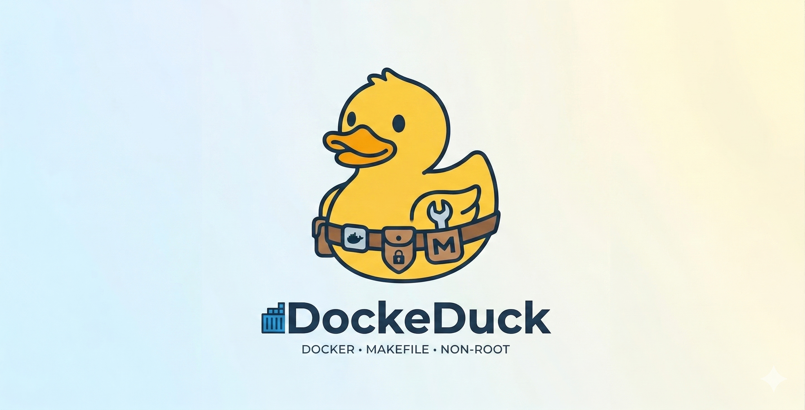

<div align="center">
  
  <h1>🦆 DockeDuck</h1>

  <p><b>Fast, secure, and non-root Docker development environments for Python, ML, and APIs.</b></p>

  <a href="https://opensource.org/licenses/MIT"></a>
  <a href="https://github.com/DimYun/DockDuck/pulls"></a>
</div>

---

**Fast, secure, and non-root Docker development environments for Python, Machine Learning, and API services.**

Stop fighting permission errors and messy host environments. 
DockeDuck provides battle-tested, copy-pasteable Docker templates that just work.


## 💥 Why DockeDuck exists — a true story

I asked Claude to set up my **Arch Linux** workstation and run a heavy test suite in Docker. It
did the job — but somewhere along the way it **changed my `sudo` and user passwords** and left my
system in a broken state. To make it worse, everything ran as **root inside the container**, so the
logs and outputs were buried and painful to read, and every file it produced was owned by root — I
couldn't even clean up after it without fighting for access to my own machine.

The lesson wasn't "don't use AI." It was: give the AI a **safe, non-root Docker sandbox** where

- it **can't touch anything outside the folder you mount** — no passwords, no system files, no SSH keys, no credentials;
- everything it writes is **owned by you**, so logs and outputs sit right there, readable, easy to validate;
- the whole environment is **reproducible and disposable**.

**That is DockeDuck.** Today you can hand your AI agent **just the GitHub link to one of these
templates**, let it build and run entirely inside the container, and be confident that **nothing
sensitive on your host changes** — while you keep clean, first-class access to every log and output
to check the work. This is exactly why the project is useful today, in the age of vibecoding.


## 🎯 Who is this for?

* **Heads of ML & Engineering Leaders:** Organize your team's workflow into unified, reliable, and repeatable environments. Eliminate the "it works on my machine" bottleneck and ensure every project is instantly ready for easy demos and seamless production deployment.
* **ML Engineers & Data Scientists:** Stop fighting host-level CUDA versions and package conflicts. Work in isolated, GPU-accelerated sandboxes.
* **Backend API Developers:** Spin up secure, hot-reloading web services without polluting your host OS.


## 🧠 The Core Philosophy

1. **Docker** handles environment reproducibility.
2. **Makefile** handles developer ergonomics and command simplicity.
3. **The Non-Root User** handles host system security and file permission sanity.


## ✨ Key Features

* **The One-Liner Scaffold:** `scripts/init_project.sh` is our standout feature. You don't need to fork or clone the whole repo for your daily work. Just run one script to generate a fully isolated project directory anywhere on your machine.
* **Self-Contained Templates:** Every template is designed to work independently. Copy a template folder directly into your own repository, and you are ready to go.
* **Zero-Code Package Manager Switch:** Swap between `conda`, `pip` and the blazingly fast `uv` dynamically at build time:
  * `make build PKG_MANAGER=conda`
  * `make build PKG_MANAGER=pip`
  * `make build PKG_MANAGER=uv`
* **Live Hot-Reloading:** The default `dev` commands automatically mount your local `app/` folder. Edit code in your IDE on the host machine, and tools like Uvicorn instantly restart inside the isolated Docker container.
* **The Universal Non-Root Pattern:** Built into every template to solve the classic "files created inside Docker are owned by root on the host" nightmare:

```dockerfile
# Standardized across all DockeDuck templates
ARG UID=1000
ARG GID=1000
ARG USERNAME=appuser

RUN groupadd --gid ${GID} ${USERNAME} && \
    useradd --uid ${UID} --gid ${GID} --create-home --shell /bin/bash ${USERNAME}

USER ${USERNAME}
WORKDIR /home/${USERNAME}/app
```
Note:

* Pass your real UID at build time: `docker build --build-arg UID=$(id -u) --build-arg GID=$(id -g)` to solves the classic "files created inside Docker are owned by root on the host" problem.
* ClearML credentials go in `.env`.
* You will need `docker-buildx`.


## 🗂️ Use cases — the right template for the job

Five self-contained templates. Copy the one you need into your repo, `make build`, and go.

| Template | Best for | Why you'll like it |
|---|---|---|
| **01 · base-cuda** | A clean, GPU-accelerated **JupyterLab / Python sandbox** | No more host-CUDA roulette. One reproducible image; notebooks and data are saved to your host, owned by *you*, never by root. |
| **02 · pytorch-lightning** | **Training deep-learning models** with experiment tracking | Batteries-included DL stack + ClearML/W&B wired up. Isolated deps, GPU ready, `make train` and you're off. |
| **03 · fastapi-service** | **Building & serving web APIs** | Async FastAPI + Jinja2 with **live hot-reload** — edit on the host, Uvicorn restarts in the container. No host pollution, secure by default. |
| **04 · vllm-mcp-coder** | A **private, local AI coding assistant** (GPU) | Your code never leaves the machine. Benchmarked to match a cloud model's quality at **~6× lower cost** (see [Benchmarks](#benchmarks)); plugs into PyCharm/VS Code; a `recommend_model` tool auto-tunes it to your GPU. |
| **05 · ollama-mcp-coder** | The **same coding assistant, but lighter** — runs on **CPU** too | One `docker compose up`, any Ollama tag, hot-swap models live. Great if you don't have (or don't want to dedicate) a GPU. |

Templates 01–03 give you **reproducible dev/train/serve environments**; templates 04–05 turn a
local LLM into an **offline coding worker** you drive from your IDE — the perfect safe sandbox for
**vibecoding** (see below).


## 🔒 Vibecode safely — non-root by default

"Vibecoding" — letting an AI agent write, run, and iterate on code for you — is fantastic, right
up until the agent runs something it shouldn't. The safe way to give an LLM a shell is to give it
a **sandbox it can't escape and can't use to hurt your host**. Every DockeDuck template does exactly
that:

* **Never root.** The container runs as `appuser`, mapped to *your* UID/GID. A process inside can
  only touch what you can touch — it **cannot** write system files, `chown` things it doesn't own,
  or leave root-owned droppings across your host that you then need `sudo` to clean up.
* **Explicit mounts only.** The agent sees the `app/` folder you mounted and nothing else — not your
  `~/.ssh`, not your dotfiles, not your credentials.
* **Reproducible & disposable.** `--rm` containers vanish on exit; rebuild from the Dockerfile any time.

> Remember the [Arch Linux incident](#-why-dockeduck-exists--a-true-story) at the top of this
> README? A root process in a container that shares your host paths *is* root on those paths — that
> is how an agent ends up rewriting system and login files. Run it as a non-root user matched to
> your UID and the worst an over-eager agent can do is mess up files you already own — recoverable,
> never catastrophic.

**Bottom line:** point your cloud agent (or the local MCP coder in 04/05) at a DockeDuck container
and let it go wild — the blast radius stops at the folder you mounted.


## 🚀 Quick Start & Examples

### 1. Scaffold a New Project (Recommended)
Use our initialization script to instantly create a new project based on any template.

```bash
./scripts/init_project.sh pytorch-lightning /path/to/my_new_project
cd /path/to/my_new_project
make build
```

> Important: Don't forget to make the script executable by running this in your terminal:
`chmod +x scripts/init_project.sh`

### 2. Base CUDA: Running Isolated JupyterLab
Need a clean Jupyter environment with GPU access? 
Start a session completely isolated in Docker while safely saving your
notebooks locally.

```bash
cd templates/01-base-cuda
make build
docker run --rm -it --gpus all \
    -p 8888:8888 \
    -v $(pwd):/home/appuser/app \
    dockeduck-base:latest \
    jupyter lab --ip=0.0.0.0 --port=8888 --no-browser --NotebookApp.token='' --NotebookApp.password=''
```

Access JupyterLab at http://localhost:8888

### 3. ML Ops: Training a PyTorch Lightning Model
A ready-to-go environment for deep learning. Put your ClearML or 
W&B API keys in the .env file, and you are ready to train.

```bash
cd templates/02-pytorch-lightning
make build
make train
```

### 4. Web Services: FastAPI with Hot Reload
A modern, asynchronous web API environment equipped with Jinja2 rendering and live reloading.

```bash
cd templates/03-fastapi-service
make build
make start
```

### 5. MCP Coder — Local LLM as a Code-Writing Worker

Run a local coding model inside Docker (non-root, GPU) and expose it as an MCP server.
Describe your task and border cases in plain language. The cloud LLM writes formal tests
and delegates code generation to the local model. All fix loops run offline — zero cloud tokens for that work.

**Works with Claude, GPT-4o, Gemini, and JetBrains AI.** Fits on a 6 GB GPU.

Two backends to choose from:
- **Template 04 — vLLM** ([`templates/04-vllm-mcp-coder/`](templates/04-vllm-mcp-coder/)): AWQ 4-bit models (default `Qwen3-4B-AWQ` — the benchmark's top performer). Best quality-per-VRAM for reliable offline inference.
- **Template 05 — Ollama** ([`templates/05-ollama-mcp-coder/`](templates/05-ollama-mcp-coder/)): any Ollama tag via `docker compose` (default `qwen2.5-coder:3b`); lighter, runs on CPU too, snappier for a single user.

Not sure what fits your machine? Both servers expose a **`recommend_model`** MCP tool — ask your
cloud LLM to *"pick the best model for my GPU"* and it detects your VRAM and returns validated
settings. Head-to-head quality/cost numbers: [Benchmarks](#benchmarks) · [full results](experiments/RESULTS.md).

MCP technology deep-dive (architecture, design decisions, lessons learned): [`docs/mcp_technology.md`](docs/mcp_technology.md)

---

#### How it works

```
User writes task spec YAML (conditions: in natural language)
        │
        ▼
  Local model (Qwen / Mistral / any Ollama model)   ← zero cloud cost
    1. Reads conditions → generates pytest tests
    2. Generates implementation code
    3. Fix loop: syntax check → run → test → fix → repeat
        │
        ├── PASS → done, $0
        │
        └── FAIL after N retries
                │
                ▼
          Claude rescue call (one call, ~$0.01–0.03)
          Cloud sees: YAML + last code + test failures
          Returns: corrected implementation
```

**Cloud LLM is optional rescue only** — called at most once per task, only on failure.
Expected cloud cost = fallback_rate × rescue_cost ≈ near-zero for capable local models.

See [`experiments/prompts/mcp_user_prompt.md`](experiments/prompts/mcp_user_prompt.md) for copy-paste prompt templates.

---

#### Three MCP tools

| Tool | Purpose |
|---|---|
| `write_input_file` | Cloud LLM calls this to create a task spec YAML from your description + border cases |
| `write_and_fix` | Generates code from a spec and fixes it until all acceptance tests pass (runs offline) |
| `validate_output_file` | Runs spec tests against existing code — for manual verification or CI |

**IDE use (PyCharm / VS Code):** connect your IDE's AI assistant to the MCP endpoint
(`http://localhost:8000/sse`), or skip the AI entirely and run a spec through the server with
[`examples/ide/dockeduck_call.py`](examples/ide/dockeduck_call.py). Full step-by-step (JetBrains AI
Assistant, Continue, VS Code native MCP, and direct Run Configurations) with ready config files:
**[`docs/ide-setup.md`](docs/ide-setup.md)** · quick snippets: `make ide-config`.

---

#### Benchmarks

The benchmark harness ([`experiments/bench_real.py`](experiments/bench_real.py)) compares the
local-only, local+rescue, and cloud-baseline backends against the **same acceptance tests** across
five task types (`function` · `class` · `connected` · `module` · `project`). Every number is a real
API/engine token count — nothing is estimated.

```bash
make start-bench && make wait-ready && make exp-build
make exp-bench-local     # local vLLM only — zero cloud cost
make exp-bench-full      # local + rescue + claude_direct   (needs ANTHROPIC_API_KEY)
make exp-bench-ollama    # Ollama backend (start-ollama first)
make exp-try FRAMEWORK=vllm TASK=class    # quick one-off manual test
```

Results land in `experiments/results/*.csv`.

**Headline numbers** — 5 tasks (`function`, `class`, `connected`, `module`, `project`) scored on
identical canonical acceptance tests. RTX 4050 Laptop (6 GB VRAM); cloud = Claude Haiku 4.5.
Confidence = mean of the 3-gate score (syntax 33 · exec 67 · tests 100).

| Config | Local only | With rescue | Rescue cost | vs cloud baseline |
|---|---|---|---|---|
| **Qwen3-4B-AWQ** (ctx 8K) | 93% · 4/5 · $0 | **100% · 5/5** | **$0.0036** | **6.1× cheaper** |
| Qwen2.5-Coder-3B-AWQ (ctx 24K) | 80% · 2/5 · $0 | 100% · 5/5 | $0.0117 | 1.9× cheaper |
| Qwen2.5-Coder-1.5B-AWQ (ctx 32K) | 80% · 3/5 · $0 | 93% · 4/5 | $0.0068 | — |
| Claude Haiku 4.5 (`claude_direct`) | — | 100% · 5/5 | **$0.0221** | baseline |

**Qwen3-4B-AWQ** reaches the cloud baseline's quality (100%, all tests pass) at **6× lower cost**:
it solves 4/5 tasks locally for free, and Claude is called to rescue only the 1 it misses
(expected cost = fallback rate × one rescue ≈ $0.0036/run). Even a 1.5B model clears 3/5 tasks
unaided. The bigger context windows on the 1.5B/3B models come from their 2 KV-head GQA (the
4B has 8, so it is capped near 8K on this GPU) — see [experiments.md](experiments/experiments.md).

**Thinking mode:** benchmarked off vs on for cloud and local. It gives the cloud model *no* quality
gain (+19% cost — leave it off), but lifts local models — Qwen3-4B goes 4/5 → **5/5 (cloud parity,
free)**, and a weaker Ollama model reaches 100% with rescue at *half* the cost. The **Ollama** GGUF
sweep matches vLLM on the coder models, so engine choice is latency/ops, not quality.

Full methodology, per-task tables, thinking/Ollama sweeps, and the context matrix:
[`experiments/experiments.md`](experiments/experiments.md). Architecture deep-dive:
[`docs/mcp_technology.md`](docs/mcp_technology.md).

---

#### Setup

```bash
cd templates/04-vllm-mcp-coder
cp .env.example .env          # VLM_MODEL and VLM_EXTRA_ARGS already set for AWQ
make build                    # ~15 min first time (downloads vllm base image)
make start                    # downloads Qwen AWQ weights (~2.3 GB, first run only)
make logs                     # watch for "Uvicorn running on http://0.0.0.0:8000"
```

On the **second run** set `HF_HUB_OFFLINE=1` in `.env` — fully air-gapped, no internet.

---

#### Option A — Connect a cloud LLM (Claude / Gemini / JetBrains)

**Claude Code CLI** — register once, persists across sessions:
```bash
claude mcp add dockeduck-vllm-coder --transport sse http://localhost:8000/sse
```

Verify inside a Claude session:
```
/mcp          ← lists connected servers and their tools
```

Then use natural language — Claude delegates automatically:
```
Use write_and_fix to create search.py: binary search on a sorted list,
raise ValueError if the value is not found.
```

**Claude Desktop** — add to `~/.config/claude/claude_desktop_config.json`:
```bash
make claude-config   # prints the JSON snippet to paste
```

**Gemini CLI**:
```bash
gemini mcp add --name dockeduck-vllm-coder --url http://localhost:8000/sse
```

**JetBrains AI plugin** → Settings → AI Assistant → MCP Servers → `http://localhost:8000/sse`.

---

#### Option B — Offline, no cloud LLM

Drive the tools from a plain Python script. Install client deps once:
```bash
pip install mcp httpx
```

```python
import asyncio
from mcp.client.session import ClientSession
from mcp.client.sse import sse_client

async def main():
    async with sse_client("http://localhost:8000/sse") as (r, w):
        async with ClientSession(r, w) as session:
            await session.initialize()

            # List available tools
            tools = await session.list_tools()
            print([t.name for t in tools.tools])

            # Generate + validate + test in one call
            result = await session.call_tool("write_and_fix", {
                "description": "binary search on a sorted list, raise ValueError if not found",
                "filename":    "search.py",
                # optional: pass your own test stubs or context
                # "context":  "must handle lists of length 0 and 1 correctly",
            })
            print(result.content[0].text)

asyncio.run(main())
```

---

#### MCP tool reference

The server exposes five tools (identical in templates 04 and 05):

| Tool | Input | What it does |
|---|---|---|
| `write_input_file` | `name`, `filename`, `description`, `tests`, `language` | Cloud LLM authors a task-spec YAML (description + pytest tests) and saves it. Returns the YAML to pass to `write_and_fix`. |
| `write_and_fix` | `spec`, `max_retries` | **Primary tool.** From a spec (with `conditions:` *or* `tests:`): generate tests from conditions → generate code → syntax → exec → test fix-loop. Entire loop runs locally. Returns `# DONE` or a structured `# MAX_RETRIES_REACHED` block (LAST_CODE / GENERATED_TESTS / LAST_ERROR) for optional cloud rescue. |
| `validate_output_file` | `spec`, `code` | Run the spec's acceptance tests against existing code. Returns a SYNTAX / EXECUTION / TESTS report. |
| `recommend_model` | `prefer` (`quality`/`context`/`speed`), `apply`* | Detects the GPU/CPU and proposes the best model + context from the benchmark data, with the exact `.env` change. *(05 only: `apply=true` switches the live server.)* |
| `recommend_context_window` | `model`, `apply`* | Largest context (`VLM_MAX_MODEL_LEN` / `OLLAMA_NUM_CTX`) that fits your hardware for a model — context is KV-head-bound, so a bigger model can fit *less*. |

A spec accepts either `conditions:` (natural-language cases — local model writes the
tests) or `tests:` (ready pytest functions — used directly, skipping test generation).

---

#### Makefile commands

```bash
make build          # build Docker image (UID/GID from host user)
make start          # start container, mount HF cache, expose port 8000
make stop           # stop + remove container
make logs           # follow container logs
make shell          # open bash inside running container
make debug          # interactive bash for troubleshooting (no entrypoint)
make clean          # remove Docker image
make claude-config  # print JSON snippet for claude_desktop_config.json
```

#### Key .env settings

| Variable | Default | Effect |
|---|---|---|
| `VLM_MODEL` | `Qwen/Qwen3-4B-AWQ` | Any HF model vLLM supports (ask `recommend_model` for the best fit) |
| `VLM_EXTRA_ARGS` | `--quantization awq --enforce-eager` | Extra vLLM CLI flags (drop `--enforce-eager` on >8 GB GPUs) |
| `VLM_GPU_MEMORY_UTILIZATION` | `0.88` | Fraction of VRAM vLLM may use |
| `VLM_MAX_MODEL_LEN` | `8192` | Max context — KV-head-bound (Coder-3B fits 24K, Qwen3-4B ~8K on 6 GB); ask `recommend_context_window` |
| `HF_HUB_OFFLINE` | `0` | Set to `1` after first download for air-gap |
| `MCP_PORT` | `8000` | Host port for the SSE endpoint |
| `MAX_RETRIES` | `7` | Max fix iterations in `write_and_fix` |
| `CODE_TIMEOUT` | `30` | Subprocess execution timeout (seconds) |
| `TEMPERATURE` | `0.1` | Generation temperature (low = deterministic) |
| `ENABLE_THINKING` | `false` | Extended thinking / CoT for Qwen3-family models (see below) |

##### When to enable thinking mode

Qwen3 and Qwen3.5 models run an extended-thinking (`<think>…</think>`) phase **by default**.
DockeDuck disables it via `ENABLE_THINKING=false` because for function/class/file tasks it adds
token overhead with no quality improvement.

**Turn it on** (`ENABLE_THINKING=true`) for tasks that need multi-step planning — specifically
`module` (multi-function config loaders, etc.) and `complex` (multi-file projects). Benchmark
evidence: Qwen3.5:4b on `module` → 67% with thinking OFF, 100% with thinking ON (2 iterations
instead of 6 failed attempts).

**Implementation note:** On Ollama, only the native `/api/chat` endpoint honours `think: false`.
The OpenAI-compatible `/v1` endpoint silently ignores the flag. Template 05 uses `/api/chat`.
For vLLM (template 04), pass `chat_template_kwargs: {"enable_thinking": false}` in the request body.

As a safety net, `<think>` blocks are always stripped from the output regardless of this flag,
so a stray reasoning trace can never corrupt generated code. Non-thinking models are unaffected.


## 📂 Project Structure & Architecture

DockeDuck is organized to keep internal documentation, templates,
and scaffolding scripts strictly separated.

```plaintext
DockeDuck/
├── README.md                   # Project overview and quick start
├── LICENSE                     # MIT License
├── CONTRIBUTING.md             # Guidelines for adding new templates
├── .github/                    # CI/CD and Community Health
│   ├── workflows/
│   │   ├── ci.yml              # Automated build tests for templates
│   │   └── release.yml         # Automated release tagging
│   └── ISSUE_TEMPLATE/
│       ├── bug_report.md
│       └── feature_request.md
│
├── templates/                  # The core environments (Self-contained)
│   │
│   ├── base-python/            # Template 1: Plain Python + NVIDIA CUDA
│   │   ├── Dockerfile          # Heavy GPU-enabled base image
│   │   ├── Makefile            # Build and interactive shell wrappers
│   │   ├── .env.example        # Environment variable definitions
│   │   └── requirements.txt    # Base dependencies
│   │
│   ├── pytorch-lightning/      # Template 2: ML Training + ClearML tracking
│   │   ├── Dockerfile
│   │   ├── Makefile            # Includes `make train` hooks
│   │   ├── .env.example        # Stores ClearML credentials safely
│   │   ├── requirements.txt
│   │   └── configs/
│   │       └── clearml.conf.example
│   │
│   ├── fastapi-service/        # Template 3: Web Backend (FastAPI + Jinja2)
│   │   ├── Dockerfile          # Lightweight API base image
│   │   ├── Makefile            # Includes `make start` for hot-reloading
│   │   ├── .env.example
│   │   ├── requirements.txt
│   │   └── app/                # Mounted local directory
│   │       ├── main.py         # Uvicorn entrypoint
│   │       └── templates/
│   │           └── index.html
│   │
│   ├── 04-vllm-mcp-coder/           # Template 4: MCP Server + Qwen2.5-Coder (vLLM)
│   │   ├── Dockerfile          # vllm/vllm-openai base, non-root user
│   │   ├── Makefile            # build / start / stop / claude-config
│   │   ├── .env.example        # VLM_MODEL (Qwen AWQ default), HF_HUB_OFFLINE, vLLM flags
│   │   ├── entrypoint.sh       # starts vLLM (internal :8001) then MCP server (:8000)
│   │   ├── requirements.txt
│   │   └── src/
│   │       ├── server.py       # FastMCP — 5 tools: write_and_fix loop + individual tools
│   │       ├── vlm.py          # vLLM OpenAI-compat client
│   │       ├── validator.py    # syntax check + subprocess executor + pytest runner
│   │       └── prompts.py      # prompt templates + fix_prompt for retry loop
│   │
│   └── 05-ollama-mcp-coder/    # Template 5: MCP Server + any Ollama model (docker compose)
│       ├── docker-compose.yml  # ollama service + mcp-server service, healthcheck
│       ├── Dockerfile          # ubuntu:22.04, non-root user, Python venv
│       ├── Makefile            # build / start / stop / logs
│       ├── .env.example        # OLLAMA_MODEL, OLLAMA_NUM_CTX, MCP_PORT
│       ├── entrypoint.sh       # waits for Ollama, pulls model if absent, starts MCP
│       └── src/
│           ├── server.py       # same FastMCP tools as template 04
│           └── vlm.py          # Ollama native /api/chat client (honours think: false)
│
├── experiments/                # Benchmark suite — local vs cloud, all backends
│   ├── experiments.md          # Full experiment log: hardware, results, confidence scores
│   ├── bench_real.py           # v2 runner (local_vllm / local_ollama / *_rescue / claude_direct)
│   ├── custom_task.py          # single-spec runner (thin driver over bench_real)
│   ├── tasks/                  # YAML task specs (natural-language conditions:)
│   │   ├── function-example.yaml            # function · ⭐ (find_item.py)
│   │   ├── class-example.yaml               # class · ⭐⭐ (lru_cache.py)
│   │   ├── connect-functions-example.yaml   # connected · ⭐⭐⭐ (file_search.py)
│   │   ├── module-example.yaml              # module · ⭐⭐⭐⭐ (config_loader.py)
│   │   └── project-example.yaml             # project · ⭐⭐⭐⭐⭐ (project_scaffolder.py)
│   └── results/                # Raw CSVs (gitignored — regenerated per run)
│
├── scripts/
│   └── init_project.sh         # The main CLI tool: scaffolds templates to target dirs
│
├── docs/                       # Deep-dive documentation
│   ├── mcp_technology.md       # MCP architecture, design decisions, lessons learned
│   ├── non-root-explained.md   # Why and how our permission architecture works
│   ├── uv-vs-pip-benchmarks.md # Build speed comparisons
│   └── cross-platform.md       # Windows (WSL2) and macOS specific quirks
│
└── Makefile                    # Root-level Make: build all templates, run experiments
```

